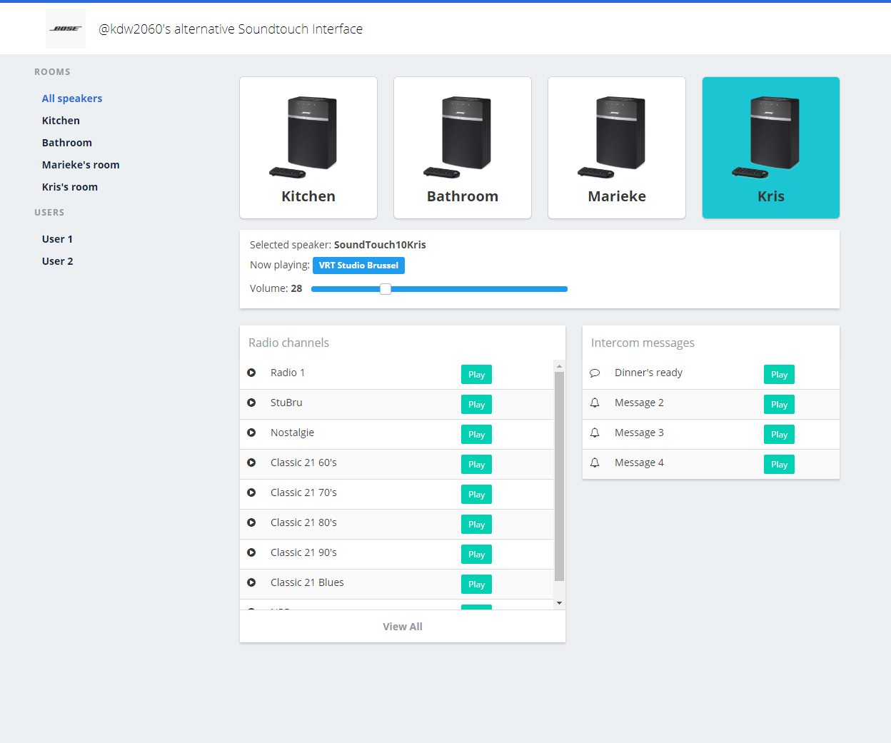

# My Alternative for Bose's SoundTouch App

WORK IN PROGRESS - NOT FINISHED - HELP WELCOME

This web-app doesn't feature all SoundTouch functions, I just wanted to build something with two features that I feel are missing from the official app:
- store more than 6 radio presets 
- the ability to use the speakers as an intercom

At the moment it only works if you run it locally on your pc.

## Installation and configuration

1. Download or fork this project
2. Edit the speaker array and the discovery-function in `server.js` to match your speaker lay-out. Use the exact names you gave them when you configured them.
3. Only if you want to use the intercom functionality: 
    - get a developer API key from http://developer.bose.com
    - enter your key on line 5 in `scripts.js`

4. Install with `npm install` from the node console
5. Run `node server.js` and point your browser to localhost:3000

## Still to come

Wanna help out with this project? Here are some To Do's:

**Make it work on any webserver**

At the moment the app only works when running it locally on your pc. I want to install it on a permanently running webserver though so I can access it form my phone. My personal options for running the node server are either my NAS or a Raspberry Pi running Hass.io --> I could really use some help with this part. The `config.json` is an early attempt at turning it into a Hass.io addon, but I'm still figuring that stuff out.

**Polish**
- add error handling where missing

**Functionality**
- make an array of radio-stations (per user), then use these values in stead of hard-coding them in the html
- add the ability to search and add stations from within the app
- in stead of hardcoding the speaker-names, use the Bose API to read out the names and make a dynamic array; also use this to dynamically build the speaker cards and select box

### Some Credits
I built the lay-out with Bulma css starting from the admin template @ https://dansup.github.io/bulma-templates/

This nice package made it easy to discover the speakers on the local network: https://github.com/watson/bonjour

The sample sound for the intercom function was found here: https://freesound.org/people/11linda/sounds/234034/